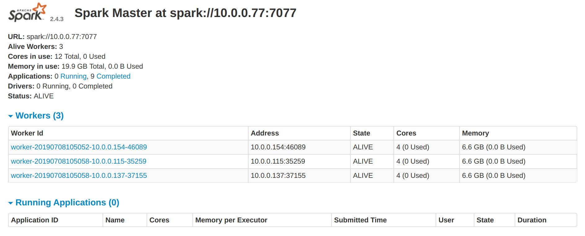
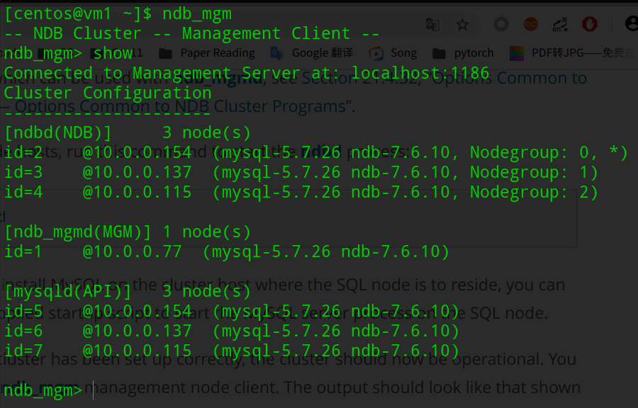

#### 1.系统环境概述

我们的分布式事务处理系统（DTSS）部署在一个由多台虚拟主机组成的集群中，这个集群通过openstack平台统一创建与管理。

以下是该集群的具体配置:

\- 节点数及名称: 4 （vm1 vm2 vm3 vm4）

\- 节点实例资源：4vCPU + 8GB内存空间 + 80GB硬盘空间

\- 四个节点之间可通过集群网络相互通信，节点VM1绑定了浮动ip，外部网络可通过端口30430-30439与VM1通信

 

分布式事务处理系统由多个组件组成:

**-** **Hadoop集群**

Hadoop集群搭建在四个节点上，vm1为namenode，vm2，vm3，vm4为datanode，为Spark集群提供分布式存储以及yarn调度的支持


**- Spark集群**

Spark集群搭建在四个节点上, vm1为spark-master, vm2, vm3, vm4为spark-worker，本系统使用Spark平台的Spark Streaming组件完成订单数据流的处理及计算


**- Kafka消息队列**

Kafka集群搭建在vm2，vm3，vm4三个节点上，Kafka消息队列连接web API服务与Spark集群，缓冲订单消息


**- Zookeeper集群**

  Zookeeper集群搭建在vm2，vm3，vm4三个节点上，为Kafka集群提供协调服务，为事务处理系统提供分布式锁服务及配置管理服务 


  **- Mysql集群**

​    Mysql集群搭建在四个节点上，vm1为管理节点，vm2，vm3，vm4为存储节点及SQL节点，为事务处理系统提供数据库存储服务

 

  **- Order Receiver Web服务**

​    事务处理系统对用户开放Http接口，receiver服务运行在vm2，vm3，vm4节点上，vm1运行着Nginx作为网关及负载均衡器


#### 2、环境搭建

##### 基础环境

Hadoop，Spark这些平台的运行都需要一些基础环境，这里不再详述安装过程，基础环境如下：

+ Java 1.8.0_212

+ Scala 2.11.0

  

##### 节点间SSH免密通信

事务处理系统中的大部分组件都搭建在分布式集群上，这些集群启动时往往需要通过SSH进行数据传输，执行指令等操作，所以我们首先需要配置四个节点之间SSH的通信。

+ 编辑/etc/host文件使得我们不需要用ip来识别节点
  ```
  10.0.0.77   vm1
  10.0.0.154  vm2
  10.0.0.137  vm3
  10.0.0.115  vm4
  ```

+ 在每个节点上使用指令```ssh-keygen -t rsa```为每个节点生成密钥对，再将所有节点的公钥一起拷贝到每个节点的.ssh/authorized_keys文件中，这样就实现了四个节点之间SSH免密登录。


##### 搭建Hadoop集群

+ 从官网下载hadoop-3.1.2.tar.gz安装包，解压至/usr/local/hadoop文件夹

+ 编辑`hadoop-env.sh`，`yarn-env.sh`，`core-site.xml`，`hdfs-site.xml`，`maprd-site.xml`，`yarn-site.xml`等配置文件，配置文件内容不在此展示。

+ 编写`slaves`文件，添加vm2，vm3，vm4作为datanode

  ```
  vm2
  vm3
  vm4
  ```

+ 将配置好的hadoop文件夹通过scp分发给vm2，vm3，vm4

+ 使用命令`bin/hadoop namenode -format`格式化namenode

+ 使用命令`sbin/start-all.sh`启动hadoop集群，通过jps命令可以看到namenode,datanode正常启动

  ```
  master（vm1）
  [centos@vm1 ~]$ jps
  5714 SecondaryNameNode
  5963 ResourceManager
  5455 NameNode
  ```

  ```
  slaves（vm2，vm3，vm4）
  [centos@vm2 ~]$ jps
  5255 NodeManager
  5131 DataNode
  ```

  

##### 搭建Spark集群

+ 从官网上下载`spark-2.4.3-bin-hadoop2.7.tar.gz`安装包

+ 在`conf/spark-env.sh`添加配置配置hadoop目录及Spark集群配置

  ```
  export SCALA_HOME=/usr/lcoal/scala-2.11.0
  export JAVA_HOME=/usr/local/java
  export HADOOP_HOME=/usr/local/hadoop
  export HADOOP_CONF_DIR=$HADOOP_HOME/etc/hadoop
  SPARK_MASTER_IP=vm1
  SPARK_LOCAL_DIRS=/home/centos/spark-2.2.1-bin-hadoop2.7
  ```

+ 类似Hadoop集群，填写slaves文件配置vm2，vm3，vm4为spark-worker节点

+ 执行命令`sbin/start-all.sh`启动Spark集群，通过jps命令可以看到master,worker正常启动

  ```
  master（vm1）
  [centos@vm1 ~]$ jps
  5714 SecondaryNameNode
  28259 Master
  5963 ResourceManager
  5455 NameNode
  ```

  ```
  slaves（vm2，vm3，vm4）
  [centos@vm2 ~]$ jps
  5255 NodeManager
  5131 DataNode
  19101 Worker
  ```

+ 浏览器输入ip http://202.120.40.8:30431/可以看到三个Worker节点正常存活

  


##### 搭建Kafka&Zookeeper集群

由于最新版本的Kafka内置了Zookeeper，所以我们将这两个组件的搭建过程放在一起。

+ 从官网下载`kafka_2.12-2.2.0.tgz`安装包，解压

+ 创建`~/kafka-logs`和`~/data/zk`目录分别用来存储kafka log及zookeeper数据

+ 修改`config/server.properties`配置kafka，修改内容如下：

  ```
  broker.id=1       #broker id
  num.partitions=3      #分区数量，一般与broker数量保持一致
  listeners=PLAINTEXT://localhost:9092     #修改为本机ip
  zookeeper.connect=vm2:2181,vm3:2181,vm4:2181      #三台服务zookeeper连接地址
  host.name={vm2/vm3/vm4}      #根据自己的ip设置
  log.dirs=/home/centos/kafka-logs/       #logs目录
  ```

+ 修改`config/zookeeper.properties`配置Zookeeper，修改内容如下：

  ```
  #数据目录
  dataDir=/home/centos/data/zk  
  #设置连接参数
  tickTime=2000
  initLimit=10
  syncLimit=5
  #broker Id的服务地址
  server.0=vm2:2888:3888
  server.1=vm3:2888:3888
  server.2=vm4:2888:3888
  ```

+ 在每个节点的Zookeeper目录下添加myid文件，依次填写broker.id

+ 使用命令`bin/zookeeper-server-start.sh config/zookeeper.properties &`启动每个节点的Zookeeper

+ 使用命令`bin/kafka-server-start.sh config/server.properties &`启动每个节点的Kafka，通过jps命令可以看到Kafka,Zookeeper（QuorumPeerMain）正常启动。

  ```
  [centos@vm2 ~]$ jps
  4199 QuorumPeerMain
  5255 NodeManager
  4712 Kafka
  5131 DataNode
  19101 Worker
  ```

+ 创建系统所需topic`~/kafka_2.12-2.2.0/bin/kafka-topics.sh -create --zookeeper vm2:2181,vm3:2181,vm4:2181 -replication-factor 3 --partitions 3 --topic dsgroup`


##### 搭建Mysql Cluster

首先在在官网下载`mysql-cluster-gpl-7.5.15-linux-glibc2.12-x86_64.tar.gz`解压至`/usr/local/mysql-cluster`文件夹。


***Management节点***

+ 执行命令`cp bin/ndb_mgm* /usr/local/bin`将管理节点程序拷贝到PATH目录下

+ 执行命令`chmod +x ndb_mgm*` 添加可执行权限

+ 创建`/var/lib/mysql-cluster/config.ini`配置文件，填写Mysql 集群配置,可以看到我们将vm2,vm3,vm4配置为data节点及SQL节点

  ```
  [ndbd default]
  # Options affecting ndbd processes on all data nodes:
  NoOfReplicas=2    # Number of replicas
  DataMemory=200M    # How much memory to allocate for data storage
  IndexMemory=30M   # How much memory to allocate for index storage
                    # For DataMemory and IndexMemory, we have used the
                    # default values. Since the "world" database takes up
                    # only about 500KB, this should be more than enough for
                    # this example NDB Cluster setup.
                    # NOTE: IndexMemory is deprecated in NDB 7.6 and later; in
                    # these versions, resources for all data and indexes are 
                    # allocated by DataMemory and any that are set for IndexMemory
                    # are added to the DataMemory resource pool
  ServerPort=2202   # This the default value; however, you can use any
                    # port that is free for all the hosts in the cluster
                    # Note1: It is recommended that you do not specify the port
                    # number at all and simply allow the default value to be used
                    # instead
                    # Note2: The port was formerly specified using the PortNumber 
                    # TCP parameter; this parameter is no longer available in NDB
                    # Cluster 7.5.
  
  [ndb_mgmd]
  # Management process options:
  HostName=10.0.0.77          # Hostname or IP address of MGM node
  NodeId=1
  DataDir=/var/lib/mysql-cluster  # Directory for MGM node log files
  
  [ndbd]
  # Options for data node "A":
                                  # (one [ndbd] section per data node)
  HostName=10.0.0.154          # Hostname or IP address
  NodeId=2                        # Node ID for this data node
  DataDir=/usr/local/mysql/data   # Directory for this data node's data files
  
  [ndbd]
  # Options for data node "B":
  HostName=10.0.0.137          # Hostname or IP address
  NodeId=3                        # Node ID for this data node
  DataDir=/usr/local/mysql/data   # Directory for this data node's data files
  
  [ndbd]
  # Options for data node "B":
  HostName=10.0.0.115          # Hostname or IP address
  NodeId=4                        # Node ID for this data node
  DataDir=/usr/local/mysql/data   # Directory for this data node's data files
  
  [mysqld]
  # SQL node options:
  NodeId=5
  HostName=10.0.0.154         
  
  [mysqld]
  # SQL node options:
  NodeId=6
  HostName=10.0.0.137         
  
  [mysqld]
  # SQL node options:
  NodeId=7
  HostName=10.0.0.115         
  ```

  

***SQL节点***

+ 执行命令`groupadd mysql` `useradd -g mysql -s /bin/false mysql`创建Mysql用户及用户组

+ 执行命令`chown -R root . && chown -R mysql data && chgrp -R mysql .`添加必要权限

+ 执行命令`cp support-files/mysql.server /etc/rc.d/init.d/ && chmod +x /etc/rc.d/init.d/mysql.server && chkconfig --add mysql.server添加`mysql服务自启动

+ 编辑`/etc/my.cnf`配置文件，添加SQL配置

  ```
  mysqld]
  # Options for mysqld process:
  ndbcluster                      # run NDB storage engine
  
  [mysql_cluster]
  # Options for NDB Cluster processes:
  ndb-connectstring=vm1  # location of management server
  ```

+ 执行命令`mysqld --initialize` `sudo systemctl mysql start`启动mysql服务


***Data节点***

+ 执行命令`cp bin/ndbd /usr/local/bin/ndbd && cp bin/ndbmtd /usr/local/bin/ndbmtd`拷贝可执行文件到PATH目录下

+ 执行命令`cd /usr/local/bin && chmod +x ndb*`添加可执行权限

+ 编辑`/etc/my.cnf`配置文件，添加SQL配置

  ```
  mysqld]
  # Options for mysqld process:
  ndbcluster                      # run NDB storage engine
  
  [mysql_cluster]
  # Options for NDB Cluster processes:
  ndb-connectstring=vm1  # location of management server
  ```


##### *启动Mysql Cluster*

+ 进入Management节点，执行命令`ndb_mgmd -f /var/lib/mysql-cluster/config.ini`启动管理节点

+ 进入Data节点，执行命令`ndbd`启动数据节点

+ 进入Management节点，执行命令`ndb_mgm`之后`show`可以看到已经成功启动mysql集群

  


##### Nginx网关及负载均衡

+ 执行命令`sudo yum -y install nginx`安装Nginx

+ 编辑`/etc/nginx/nginx.conf`文件配置Web服务节点

  ```
  upstream serviceservers{
  	server 10.0.0.154:8080;
  	server 10.0.0.137:8080;
  	server 10.0.0.115:8080;	
  }
  
  server {
      listen        30438;
      server_name  localhost;
      root         /usr/share/nginx/html;
  
      # Load configuration files for the default server block.
      include /etc/nginx/default.d/*.conf;
  
      location / {
      	proxy_pass http://serviceservers;
      }
  
      error_page 404 /404.html;
      	location = /40x.html {
      }
  
      error_page 500 502 503 504 /50x.html;
      	location = /50x.html {
      }
  }
  
  ```

  